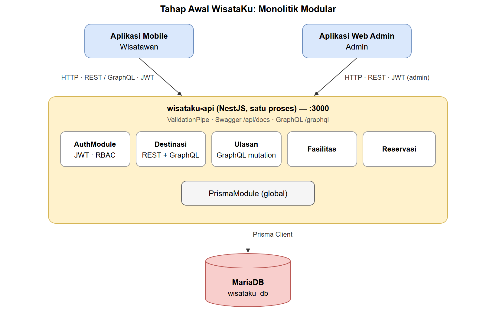

# 1. Pendahuluan

WisataKu adalah platform informasi dan reservasi destinasi wisata. Wisatawan mencari destinasi, membaca dan menulis ulasan, serta memesan tiket kunjungan melalui aplikasi mobile. Admin mengelola data destinasi melalui aplikasi web. Kedua aplikasi itu membutuhkan satu backend yang sama, sehingga backend WisataKu dirancang sebagai web service yang diakses melalui jaringan.

Laporan ini menganalisis konsep web service, gaya API, dan prinsip arsitektur terdistribusi (Bab 1 modul), lalu memakainya untuk memilih arsitektur WisataKu. Pilihan tersebut kemudian diterapkan pada repository proyek sehingga analisis ini dapat dicocokkan dengan kode yang sebenarnya.

# 2. Web Service dan API

Web service adalah perangkat lunak yang menyediakan fungsi melalui jaringan dengan protokol standar, sehingga aplikasi lain dapat memakainya tanpa mengetahui detail implementasinya. API adalah kontrak yang menentukan bagaimana dua perangkat lunak berkomunikasi: alamat yang dipanggil, data yang dikirim, dan bentuk balasan.

Pada WisataKu, aplikasi mobile tidak perlu tahu bahwa data disimpan di MariaDB atau bahwa rating dihitung ulang setiap ulasan ditambahkan. Aplikasi cukup mengikuti kontrak API, misalnya `GET /destinasi?kategori=Pantai` untuk daftar pantai. Pemisahan ini membuat tim mobile dan tim backend dapat bekerja terpisah selama kontraknya tetap.

# 3. HTTP sebagai Dasar Web API

API WisataKu berjalan di atas HTTP. Lima elemen HTTP dipakai sebagai berikut:

| Elemen | Peran pada WisataKu | Contoh |
|---|---|---|
| Method | Menyatakan aksi terhadap resource | `GET` membaca, `POST` membuat, `PATCH` mengubah sebagian, `DELETE` menghapus |
| URL | Menunjuk resource | `/destinasi/3`, `/destinasi/3/ulasan` |
| Header | Metadata dan kredensial | `Authorization: Bearer <token>`, `Content-Type: application/json` |
| Body | Data yang dikirim atau diterima | `{ "destinasiId": 3, "tanggalKunjungan": "2026-12-25", "jumlahTiket": 2 }` |
| Status code | Hasil request | 200, 201, 400, 401, 403, 404, 409 |

Status code dipakai secara semantik agar client dapat bereaksi tanpa membaca pesan teks: 401 berarti pengguna harus login, 403 berarti pengguna sudah login tetapi tidak berhak, 404 berarti destinasi tidak ada, dan 409 berarti terjadi konflik data (email sudah terdaftar atau destinasi yang sudah memiliki reservasi akan dihapus).

# 4. Perbandingan Gaya API

| Gaya API | Karakteristik | Kesesuaian dengan WisataKu |
|---|---|---|
| REST | Berbasis resource, method HTTP semantik, JSON | Sesuai untuk operasi CRUD destinasi, autentikasi, dan reservasi. Mudah dipakai aplikasi mobile maupun web dan mudah didokumentasikan dengan OpenAPI |
| GraphQL | Client menentukan field yang diambil dalam satu query | Sesuai untuk halaman detail destinasi yang membutuhkan data gabungan Destinasi + Ulasan + Fasilitas |
| SOAP | Protokol XML dengan kontrak WSDL | Terlalu berat untuk aplikasi mobile; lebih cocok untuk integrasi sistem enterprise atau legacy |
| gRPC | Protocol Buffers biner di atas HTTP/2 | Efisien untuk komunikasi antar-layanan internal, tetapi kurang praktis untuk dikonsumsi langsung oleh aplikasi mobile dan web admin |

Keputusan: WisataKu memakai **REST** sebagai API utama dan **GraphQL** untuk kebutuhan data gabungan. Keduanya dilayani oleh backend yang sama dan membaca data yang sama.

Alasan GraphQL tetap diperlukan dapat dilihat dari halaman detail destinasi. Dengan REST murni, aplikasi perlu tiga request: `GET /destinasi/:id`, `GET /destinasi/:id/ulasan`, dan `GET /destinasi/:id/fasilitas`. Dengan GraphQL cukup satu request `POST /graphql` yang meminta `destinasi(id) { nama ulasan { ... } fasilitas { ... } }`. Hal ini penting bagi aplikasi mobile yang sering berada pada koneksi lambat.

SOAP tidak dipakai. gRPC tidak dipakai secara langsung, tetapi kebutuhan komunikasi antar-layanan internal pada tahap microservices dipenuhi dengan transport TCP bawaan `@nestjs/microservices`, sesuai modul Bab 6.

# 5. Prinsip Arsitektur Sistem Terdistribusi

**Client-server.** Tampilan (aplikasi mobile dan web admin) dipisahkan dari logika bisnis dan data (backend NestJS). Aplikasi mobile dapat diganti atau diperbarui tanpa mengubah backend, dan sebaliknya selama kontrak API tetap.

**Stateless.** Server tidak menyimpan sesi login. Setiap request membawa seluruh informasi yang dibutuhkan, termasuk identitas pengguna dalam token JWT pada header `Authorization`. Token berisi `sub` (id pengguna) dan `role`, sehingga server mana pun yang memegang secret yang sama dapat memverifikasinya. Sifat ini yang memungkinkan backend dijalankan dalam beberapa instance atau dipecah menjadi beberapa layanan tanpa berbagi penyimpanan sesi.

**Layered system.** Client tidak mengetahui lapisan di belakang titik masuk yang dipanggilnya. Pada tahap akhir, aplikasi mobile hanya berkomunikasi dengan API Gateway di port 3000; gateway meneruskan request ke `service-destinasi` atau `service-reservasi`, yang kemudian mengakses MariaDB. Lapisan internal dapat diubah tanpa memengaruhi client.

**Cacheable dan uniform interface.** Request `GET` untuk daftar dan detail destinasi bersifat aman dan idempoten sehingga dapat di-cache. Seluruh resource mengikuti pola URI dan method yang sama (`/destinasi`, `/destinasi/:id`, `/destinasi/:id/ulasan`).

# 6. Monolitik vs Microservices

| Aspek | Monolitik | Microservices |
|---|---|---|
| Struktur kode | Satu basis kode, satu proses | Beberapa layanan kecil yang terpisah |
| Deployment | Satu unit | Independen per layanan |
| Skalabilitas | Seluruh aplikasi diskalakan bersama | Layanan yang sibuk dapat diskalakan sendiri |
| Kompleksitas | Rendah: satu proses, satu log, pemanggilan fungsi biasa | Tinggi: komunikasi jaringan, penanganan layanan yang mati, orkestrasi container |
| Cocok untuk | Tim kecil, tahap awal | Aplikasi besar, tim terpisah per domain |

## 6.1 Mengapa monolitik modular sebagai tahap awal

Pertanyaan latihan Bab 1.4 langkah 6: mengapa WisataKu tidak langsung dibangun sebagai microservices?

1. **Domain belum stabil.** Di awal proyek, batas antara Destinasi, Ulasan, dan Reservasi masih dapat berubah. Memindahkan kode antar-modul dalam satu proses jauh lebih murah daripada mengubah kontrak antar-layanan yang berkomunikasi lewat jaringan.
2. **Tim kecil.** Tugas 1–4 dikerjakan individu. Microservices menambah pekerjaan operasional (beberapa proses, konfigurasi jaringan, Docker) yang belum sebanding dengan manfaatnya.
3. **Kebutuhan skala belum ada.** Belum ada data trafik yang menunjukkan bagian mana yang perlu diskalakan terpisah.
4. **NestJS sudah modular.** Dengan Module, Controller, dan Provider, batas domain sudah terlihat sejak awal (`DestinasiModule`, `ReservasiModule`, dan seterusnya), sehingga pemecahan menjadi microservices di kemudian hari tidak memerlukan penulisan ulang.

Poin keempat terbukti pada implementasi. Logika domain (`DestinasiService`, `ReservasiService`, `UlasanService`) ditulis sekali di `libs/domain` dan dipakai tanpa perubahan oleh aplikasi monolitik `wisataku-api` maupun microservice. Yang berubah pada tahap microservices hanya lapisan controller: dari `@Get()` HTTP menjadi `@MessagePattern()` TCP.

## 6.2 Batas domain (bounded context)

Pemecahan microservices mengikuti domain bisnis, bukan lapisan teknis:

- **Layanan Destinasi**: Destinasi, Kategori, Ulasan, Fasilitas. Ulasan tetap di layanan ini karena selalu terkait destinasi dan memperbarui `ratingRata`.
- **Layanan Reservasi**: pemesanan tiket, perhitungan `totalHarga`, validasi tanggal kunjungan.

Pembagian seperti "layanan database" dan "layanan API" dihindari karena setiap perubahan fitur akan menyentuh kedua layanan tersebut.

# 7. Arsitektur yang Dipilih untuk WisataKu

WisataKu dikembangkan dalam dua tahap.

**Tahap 1 — monolitik modular (Bab 1–5, Tugas 1–4).** Satu aplikasi NestJS (`wisataku-api`) melayani REST, GraphQL, dan autentikasi, serta langsung mengakses MariaDB melalui Prisma.

**Tahap 2 — API Gateway dan microservices (Bab 6–8, Tugas 5–6).** Client hanya mengakses API Gateway. Gateway menangani autentikasi JWT, otorisasi berbasis peran, versioning, dan agregasi respons, lalu meneruskan request ke `service-destinasi` (TCP 5001) atau `service-reservasi` (TCP 5002). Port microservice tidak dibuka ke luar.

Diagram yang dapat diedit tersedia di `arsitektur-wisataku.drawio` (dua halaman: arsitektur akhir dan tahap awal).

Aliran request pada tahap akhir, misalnya saat wisatawan membuat reservasi:

1. Aplikasi mobile mengirim `POST /reservasi` ke gateway dengan header `Authorization: Bearer <token>`.
2. Gateway memverifikasi token (401 bila tidak valid) dan role `wisatawan` (403 bila bukan).
3. Gateway mengirim pesan `reservasi.create` melalui TCP ke `service-reservasi`.
4. `service-reservasi` membaca harga destinasi dari MariaDB, menghitung total, dan menyimpan reservasi.
5. Balasan dikembalikan ke gateway lalu ke aplikasi mobile dengan status 201.

# 8. Kesimpulan

1. Backend WisataKu adalah web service yang diakses aplikasi mobile dan web admin melalui HTTP dengan kontrak API yang terdokumentasi.
2. REST dipilih sebagai gaya API utama karena sebagian besar operasi berbentuk CRUD resource. GraphQL ditambahkan untuk halaman detail destinasi yang membutuhkan data gabungan, sehingga tiga request REST dapat diganti satu query.
3. Prinsip stateless diwujudkan dengan JWT, sehingga backend dapat dipecah atau diskalakan tanpa penyimpanan sesi bersama.
4. Arsitektur dimulai sebagai monolitik modular karena domain belum stabil, tim kecil, dan belum ada kebutuhan skala. Struktur modul NestJS dan logika domain yang terpisah membuat perpindahan ke API Gateway + microservices dilakukan tanpa menulis ulang logika bisnis.
5. Pemecahan microservices mengikuti batas domain: Destinasi dan Reservasi.

# Referensi

1. Modul Praktikum Teknologi Web Service — NestJS, Prisma & MariaDB, Bab 1 dan Bab 8.2.
2. Lauret, A. (2019). *The Design of Web APIs*. Manning Publications.
3. Subramanian, H., & Raj, P. (2019). *Hands-On RESTful API Design Patterns and Best Practices*. Packt Publishing.
4. Haro, J. (2023). *Microservice APIs*. Manning Publications.
