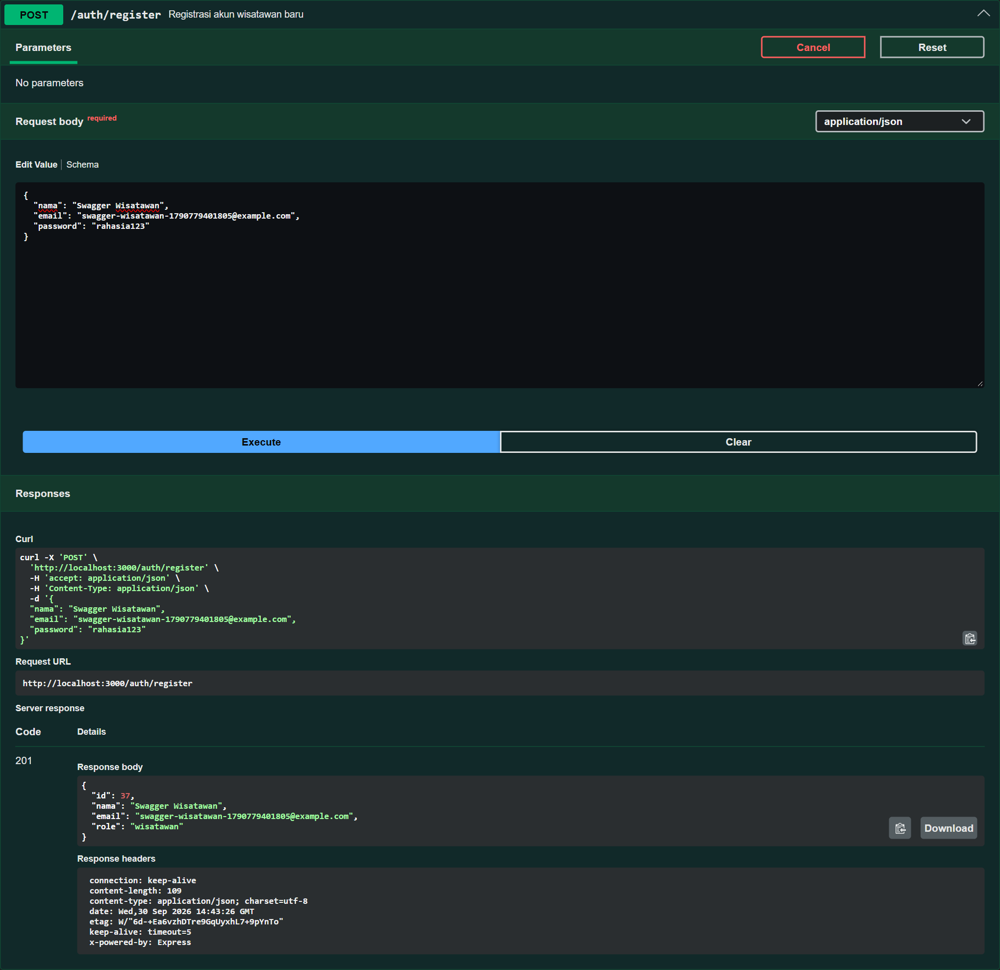
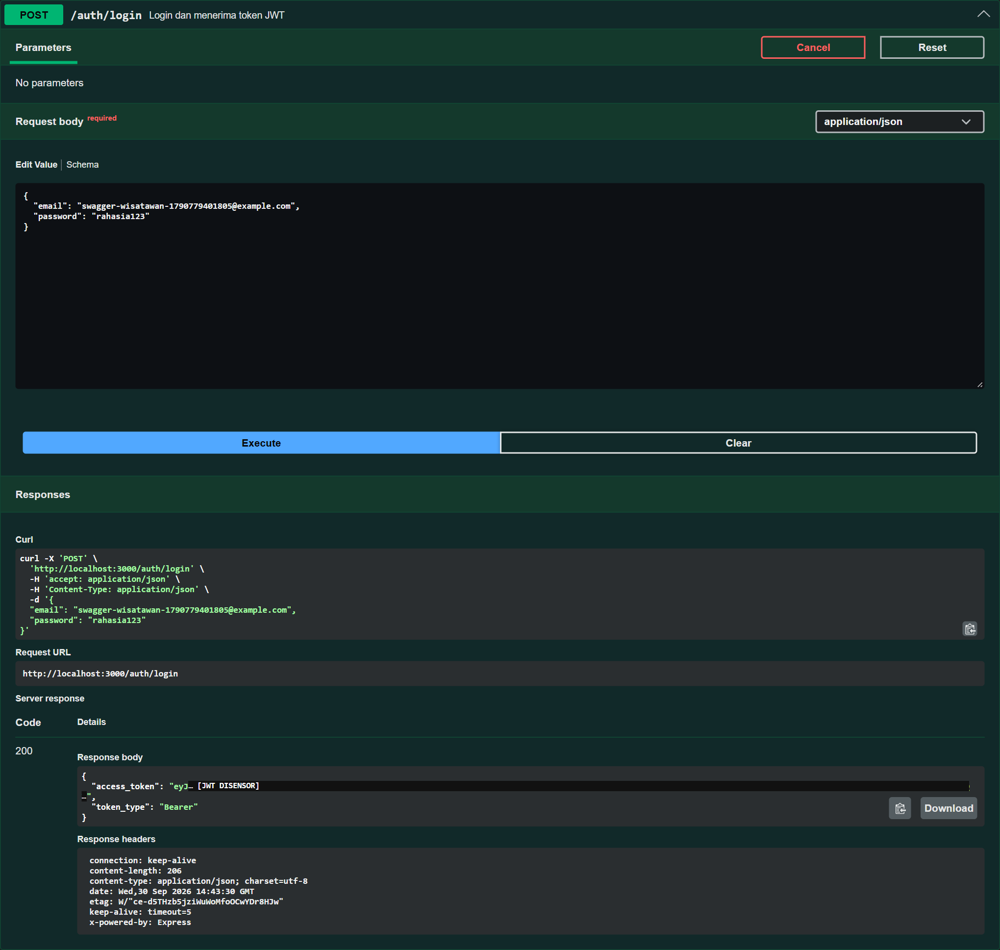
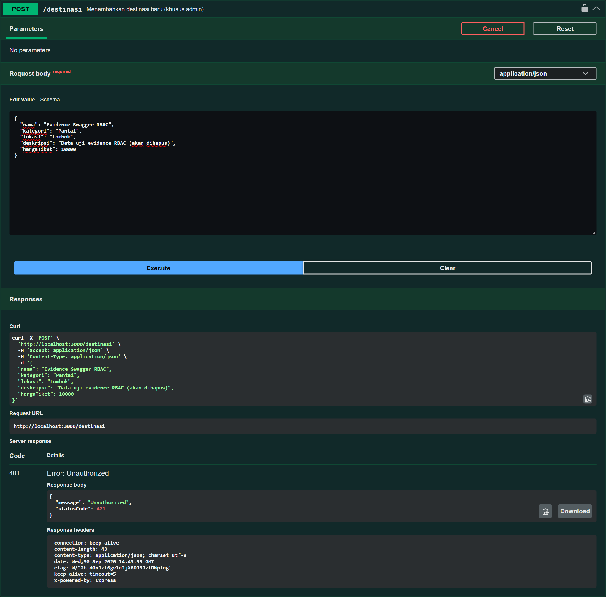
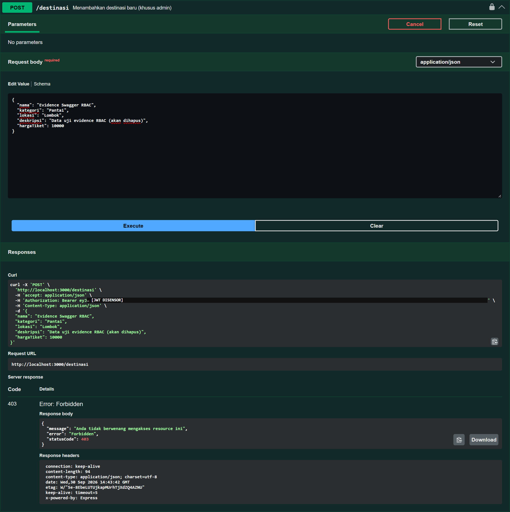
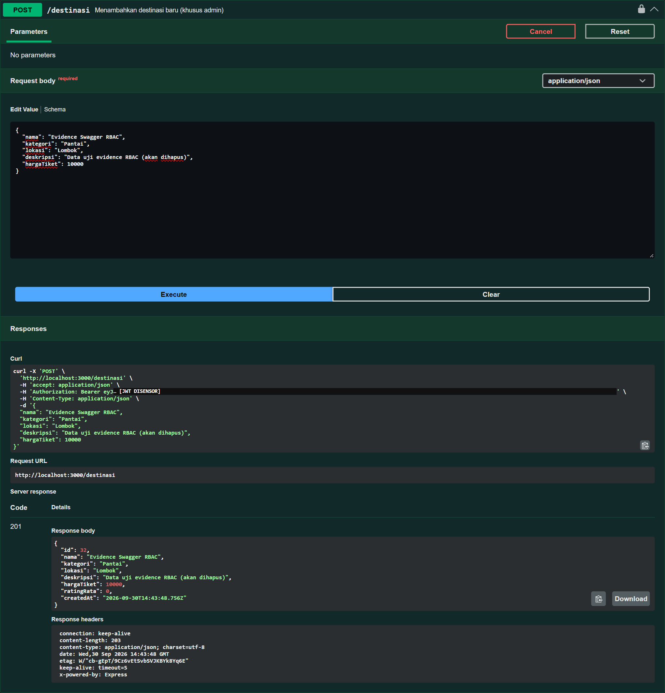

# 1. Ruang Lingkup

Tugas 4 (Bab 5 modul) menambahkan autentikasi dan otorisasi pada API WisataKu, lalu menguji API secara fungsional dan performa. Kode keamanan berada di `libs/auth` dan dipakai oleh aplikasi monolitik `wisataku-api` maupun API Gateway.

| Komponen | File |
|---|---|
| Registrasi & login | `libs/auth/src/auth.service.ts`, `auth.controller.ts` |
| Konfigurasi JWT | `libs/auth/src/auth.module.ts` |
| Verifikasi token | `libs/auth/src/jwt.strategy.ts`, `guards/jwt-auth.guard.ts`, `guards/gql-auth.guard.ts` |
| Otorisasi peran | `libs/auth/src/roles.decorator.ts`, `guards/roles.guard.ts`, `role.enum.ts` |
| Unit test | `libs/**/*.spec.ts`, `gateway/src/**/*.spec.ts` |
| E2E test | `test/destinasi.e2e-spec.ts`, `test/wisataku-flow.e2e-spec.ts` |
| Load test | `load-test.js` (salinan: `docs/tugas-4/load-test.js`) |
| Output test asli | `docs/tugas-4/test-results/` |

# 2. Autentikasi

## 2.1 Registrasi dan hashing password

`POST /auth/register` menerima `nama`, `email`, dan `password` (8–72 karakter). Alurnya:

1. Cari user berdasarkan email. Bila sudah ada → `409 Conflict`.
2. Hash password dengan `bcrypt.hash(password, 10)`.
3. Simpan user dengan kolom `passwordHash` dan role `wisatawan`.
4. Kembalikan `id`, `nama`, `email`, `role`. Hash tidak pernah dikembalikan.

bcrypt dipilih karena menyertakan salt acak pada setiap hash dan sengaja lambat (cost 10), sehingga serangan brute-force terhadap hash yang bocor menjadi mahal. Batas 72 karakter mengikuti batas input bcrypt. Pemeriksaan pada database pengembangan menunjukkan seluruh nilai `passwordHash` berawalan `$2b$10$`, yaitu hash bcrypt, bukan password asli.

Registrasi publik selalu menghasilkan role `wisatawan`. Client tidak dapat mendaftarkan dirinya sebagai admin; akun admin dibuat oleh `prisma/seed.ts` dari environment `SEED_ADMIN_EMAIL` dan `SEED_ADMIN_PASSWORD`.

## 2.2 Login dan JWT

`POST /auth/login` mencari user, membandingkan password dengan `bcrypt.compare`, lalu menandatangani JWT:

```json
{ "sub": 3, "role": "wisatawan", "iat": 1790000000, "exp": 1790003600 }
```

| Aspek | Penerapan |
|---|---|
| Algoritma | HS256, diset eksplisit saat sign dan verify |
| Secret | `JWT_SECRET` dari environment; aplikasi gagal start bila kosong |
| Masa berlaku | `JWT_EXPIRES_IN` detik (default 3600) |
| Status login sukses | 200 (`@HttpCode(200)`), sesuai skenario Bab 8.4 |
| Pesan gagal | "Email atau password salah" untuk email tidak terdaftar maupun password salah, agar email terdaftar tidak dapat ditebak |

Payload di atas adalah bentuk umum; nilai `iat`/`exp` hanya contoh.

## 2.3 Verifikasi token

`JwtStrategy` (passport-jwt) membaca token dari header `Authorization: Bearer <token>`, memverifikasi tanda tangan dan `exp`, lalu memetakan payload menjadi `request.user = { userId, role }`. `JwtAuthGuard` dipakai untuk REST. `GqlAuthGuard` adalah versi GraphQL yang mengambil request dari `GqlExecutionContext`, dipakai pada mutation `tambahUlasan`.

Server tidak menyimpan sesi. Setiap request membawa token sendiri, sesuai prinsip stateless (Tugas 1). Hal ini juga yang membuat gateway dapat memverifikasi token tanpa bertanya ke layanan lain.

# 3. Otorisasi (RBAC)

| Role | Endpoint |
|---|---|
| `admin` | `POST /destinasi`, `PATCH /destinasi/:id`, `DELETE /destinasi/:id` (juga `/v1` dan `/v2` di gateway) |
| `wisatawan` | `POST /reservasi`, mutation `tambahUlasan` |
| Publik | `GET` destinasi/ulasan/fasilitas/lengkap, query GraphQL, register, login |

Penerapan:

```ts
@Post()
@UseGuards(JwtAuthGuard, RolesGuard)
@Roles(Role.Admin)
create(@Body() dto: CreateDestinasiDto) { ... }
```

`@Roles()` menyimpan daftar peran sebagai metadata. `RolesGuard` membaca metadata itu dengan `Reflector` dan membandingkannya dengan `request.user.role`. Urutan guard menentukan status code:

| Kondisi | Guard yang menolak | Status |
|---|---|---|
| Tanpa header Authorization | `JwtAuthGuard` | 401 |
| Token rusak / tanda tangan salah | `JwtAuthGuard` | 401 |
| Token kedaluwarsa | `JwtAuthGuard` | 401 |
| Token valid, role tidak sesuai | `RolesGuard` | 403 |
| Token valid, role sesuai | — | diteruskan ke handler |

Reservasi dibatasi untuk `wisatawan` karena setiap reservasi terikat pada `userId` pembuatnya. Admin mengelola katalog, bukan memesan tiket.

# 4. Pengujian Unit (Jest)

Unit test menguji logika tanpa database: `PrismaService` diganti mock, mengikuti contoh Bab 5.3.4. `AuthService` memakai `JwtService` asli dengan secret uji, sehingga token yang dihasilkan benar-benar dapat diverifikasi.

Perintah: `npm run test`. **Hasil: 8 suite, 32 test, semua lulus.**

| Suite | Test |
|---|---|
| AuthService — register | menyimpan hash bcrypt, bukan password asli, dengan role wisatawan; menolak registrasi jika email sudah terdaftar |
| AuthService — login | mengembalikan JWT berisi `sub` dan `role` jika kredensial benar; menolak password yang salah; menolak email yang tidak terdaftar dengan pesan yang sama |
| JwtStrategy | memetakan payload `{ sub, role }` menjadi `request.user`; gagal dibuat jika `JWT_SECRET` tidak diisi |
| RolesGuard | mengizinkan handler tanpa `@Roles`; mengizinkan role yang sesuai; menolak wisatawan pada endpoint admin dengan 403; menolak request tanpa user |
| DestinasiService | filter kategori; skip dari page dan limit; findOne 404; create dengan `connectOrCreate` kategori; update 404 tanpa menyentuh database; remove → 409 saat ada reservasi |
| ReservasiService | `totalHarga` dari harga di database; tolak tanggal lampau; tolak destinasi yang tidak ada |
| HttpToRpcExceptionFilter | meneruskan status 404 dan pesan validasi; menyembunyikan detail error tak dikenal sebagai 500 |
| Klien RPC gateway | status error microservice dipertahankan; error koneksi → 503; timeout → 503 |
| Destinasi v1 vs v2 | struktur harga v1/v2 dan pemetaan input v2 ke kolom `hargaTiket` |

Output lengkap: `test-results/unit-test-2026-09-30.txt` (run terakhir, 30 September 2026; run awal di `test-results/unit-test.txt`).

# 5. Pengujian End-to-End (Supertest)

E2E test menjalankan aplikasi NestJS sungguhan terhadap MariaDB dari `DATABASE_URL`. Data uji (user dengan prefix email `e2e-` dan destinasi uji) dibuat sendiri oleh test dan dihapus setelah selesai, sehingga test tidak bergantung pada data seed dan tidak meninggalkan sisa data.

Perintah: `npm run test:e2e`. **Hasil: 2 suite, 41 test, semua lulus** (30 September 2026, MariaDB 12.1 lokal).

## 5.1 Monolit — `test/destinasi.e2e-spec.ts` (30 test)

| Kelompok | Skenario dan status yang diharapkan |
|---|---|
| Auth | register 201 tanpa password di respons; email duplikat 409; data tidak valid 400; login 200; password salah 401 |
| GET /destinasi | 200 array; filter kategori; `limit=0` 400; `/destinasi/abc` 400; `/destinasi/999999` 404 |
| Otorisasi admin | tanpa token 401; token tidak valid 401; token kedaluwarsa 401; wisatawan 403; admin dengan body tidak valid 400 |
| CRUD admin | POST 201; PATCH 200; PATCH oleh wisatawan 403; PATCH id tidak ada 404; DELETE oleh wisatawan 403; DELETE admin 200 lalu GET 404; DELETE id tidak ada 404 |
| Reservasi | wisatawan 201 dengan `totalHarga` dari server; tanggal lampau 400; hapus destinasi yang memiliki reservasi 409 |
| GraphQL | `tambahUlasan` tanpa token `UNAUTHENTICATED`; wisatawan menambah dua ulasan lalu `ratingRata` = 4.5; rating 9 `BAD_REQUEST`; destinasi tidak ada `NOT_FOUND`; `cariDestinasi` hanya kategori yang diminta |

Token kedaluwarsa dibuat dengan `JwtService.sign(payload, { expiresIn: -10 })` dari aplikasi yang sedang diuji, sehingga tanda tangannya valid dan satu-satunya alasan penolakan adalah `exp`.

## 5.2 Alur Bab 8.4 lewat gateway — `test/wisataku-flow.e2e-spec.ts` (11 test)

Gateway, `service-destinasi`, dan `service-reservasi` dijalankan dalam proses test, dengan komunikasi antar-layanan tetap melalui TCP sungguhan (port 15001/15002). Langkah 1–5 mengikuti modul: registrasi → login → cari kategori Pantai → reservasi 201 → wisatawan ditolak menghapus destinasi 403. Tanggal kunjungan pada contoh modul (`2025-12-25`) sudah lewat, sehingga test memakai tanggal 30 hari ke depan. Enam test tambahan memeriksa v1 vs v2, `/lengkap`, penerusan 404 dan 400 dari microservice, serta GraphQL lewat gateway.

Output lengkap: `test-results/e2e-test-2026-09-30.txt` (run terakhir; run awal di `test-results/e2e-test.txt`).

## 5.3 Smoke test manual

Selain test otomatis, dilakukan smoke test HTTP terhadap server hasil build yang berjalan: monolit 32/32 cek dan gateway 37/37 cek lulus. Data smoke test dihapus setelahnya.

## 5.4 Verifikasi alur JWT dan RBAC pada server berjalan

Alur keamanan juga diverifikasi secara langsung terhadap aplikasi yang berjalan di `http://localhost:3000` (30 September 2026), melalui Swagger UI ("Try it out" dan tombol **Authorize**) dan melalui curl. Token yang dipakai adalah token asli dari `POST /auth/login`. Pada gambar, nilai JWT ditutup kotak "JWT DISENSOR" agar token tidak tersebar; respons server tidak diubah.

| Langkah | Request | Hasil |
|---|---|---|
| 1 | `POST /auth/register` akun wisatawan baru | 201, body tanpa password, `role: "wisatawan"` |
| 2 | `POST /auth/login` | 200, `access_token` dan `token_type: "Bearer"` |
| 3 | `POST /destinasi` tanpa token | 401 Unauthorized |
| 4 | `POST /destinasi` dengan token wisatawan | 403 Forbidden, "Anda tidak berwenang mengakses resource ini" |
| 5 | `POST /destinasi` dengan token admin | 201 Created |

Payload JWT hasil login (bagian tengah token, di-decode base64url) berisi klaim `sub` dan `role`, misalnya `{"sub":34,"role":"wisatawan","iat":1790775329,"exp":1790778929}` untuk wisatawan dan `{"sub":1,"role":"admin",...}` untuk admin. Selisih `exp - iat` = 3600 detik, sesuai `JWT_EXPIRES_IN`. Destinasi yang dibuat pada langkah 5 dihapus kembali oleh admin (200, lalu `GET` → 404). Log curl lengkap tersimpan di `test-results/jwt-rbac-evidence.txt`.



*Gambar 5.1 `POST /auth/register` → 201. Respons berisi `id`, `nama`, `email`, dan `role` tanpa password.*



*Gambar 5.2 `POST /auth/login` → 200 dengan `access_token` (disensor) dan `token_type` Bearer.*



*Gambar 5.3 `POST /destinasi` tanpa header Authorization → 401 Unauthorized (ditolak `JwtAuthGuard`).*



*Gambar 5.4 `POST /destinasi` dengan token wisatawan → 403 Forbidden (ditolak `RolesGuard`).*



*Gambar 5.5 `POST /destinasi` dengan token admin → 201 Created.*

# 6. Pengujian Performa (k6)

Skrip `load-test.js` mengikuti Bab 5.3.6: 50 pengguna virtual selama 30 detik memanggil `GET /destinasi`, dengan jeda 1 detik per iterasi. Skrip menambahkan dua threshold, `http_req_failed < 1%` dan `p(95) < 500 ms`, sebagai kriteria lulus, serta variabel `BASE_URL` agar skrip yang sama dapat diarahkan ke gateway atau server deploy.

```bash
k6 run load-test.js
k6 run -e BASE_URL=http://<host>:3000 load-test.js
```

Load test dijalankan pada 30 September 2026 dengan k6 v2.2.0 (rilis resmi Grafana untuk Windows) terhadap monolit `wisataku-api` yang berjalan di `http://localhost:3000` dengan MariaDB 12.1 lokal. Skrip `load-test.js` dipakai tanpa perubahan.

| Metrik | Hasil |
|---|---|
| Virtual users | 50 (`vus_max` 50) |
| Durasi | 30 detik |
| `http_reqs` | 1500 request (49,59 request/detik) |
| `iterations` | 1500 |
| `http_req_duration` avg | 5,79 ms |
| `http_req_duration` median | 3,08 ms |
| `http_req_duration` p(90) | 8,73 ms |
| `http_req_duration` p(95) | 26,58 ms |
| `http_req_duration` max | 56,55 ms |
| `http_req_failed` | 0,00% (0 dari 1500) |
| Check `status 200` | 100% (1500 dari 1500) |
| Threshold `p(95)<500` | terpenuhi (26,58 ms) |
| Threshold `rate<0.01` | terpenuhi (0,00%) |

Throughput sekitar 50 request/detik sesuai rancangan skrip, yaitu 50 VU dengan jeda `sleep(1)` per iterasi. Angka ini bukan kapasitas maksimum server. Waktu respons p(95) di bawah 30 ms dan tidak ada request yang gagal, sehingga pada beban ini `GET /destinasi` jauh di bawah batas 500 ms. Pengukuran dilakukan di mesin pengembangan lokal (client dan server di mesin yang sama, tanpa latensi jaringan), sehingga hasil di server deploy dapat berbeda. Load test ke gateway termasuk lingkup Tugas 5 dan tidak dijalankan pada laporan ini.

Output asli k6: `test-results/k6-output.txt`.

# 7. Masalah yang Ditemukan Saat Pengujian

**Worker Jest kehabisan memori.** Pada mesin 16 CPU, Jest membuat sekitar 15 worker dan setiap worker ts-jest melakukan type-check penuh, sehingga proses berhenti dengan "Zone Allocation failed - process out of memory" sebelum satu test pun berjalan. Solusinya `tsconfig.spec.json` dengan `isolatedModules: true` (Jest hanya men-transpile) dan `maxWorkers: "50%"`. Pemeriksaan tipe tidak hilang, karena `npm run typecheck` tetap memeriksa seluruh file termasuk file test.

**E2E gateway membalas 503.** Port microservice untuk test di-set di badan file test, tetapi `import` dijalankan lebih dulu dan `ConfigModule.forRoot` memvalidasi environment saat `AppModule` di-import. Gateway pun mencoba port 5001/5002 dari `.env`, tempat tidak ada layanan yang berjalan. Pengaturan port dipindah ke `test/gateway-test-env.ts` yang di-import paling awal.

# 8. Kesimpulan

1. Password disimpan sebagai hash bcrypt; login menghasilkan JWT HS256 berisi `sub` dan `role` dengan masa berlaku terbatas.
2. Endpoint sensitif dilindungi `JwtAuthGuard`/`GqlAuthGuard` dan `RolesGuard`: tanpa token atau token tidak valid/kedaluwarsa → 401, role salah → 403.
3. Unit test 32/32 PASS dan E2E test 41/41 PASS (30 September 2026). Verifikasi langsung pada server berjalan: register 201, login 200 dengan JWT berisi `sub` dan `role`, tanpa token 401, wisatawan 403, admin 201. Output asli dan screenshot disimpan di `test-results/` dan `screenshots/`.
4. Load test k6 (50 VU, 30 detik, `GET /destinasi`) menghasilkan 1500 request, 0% gagal, rata-rata 5,79 ms, dan p(95) 26,58 ms; kedua threshold terpenuhi.
