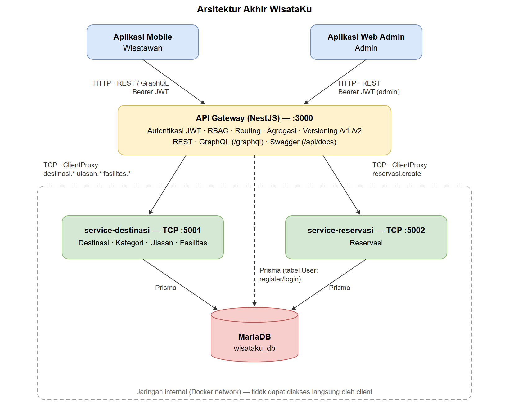

# Ringkasan Status

Dokumen ini membedakan empat status. **Implemented**: kode atau konfigurasi sudah ada di repository. **Verified**: sudah dijalankan dan hasilnya diperiksa. **Pending**: masih harus dikerjakan. **Blocked**: tidak dapat dikerjakan karena alat atau akses belum tersedia.

| Komponen | Implemented | Verified | Catatan |
|---|---|---|---|
| REST API (monolit & gateway) | Ya | Ya | e2e + smoke test |
| GraphQL API | Ya | Ya | e2e monolit & gateway |
| Autentikasi JWT, hashing bcrypt | Ya | Ya | unit + e2e |
| Otorisasi RBAC | Ya | Ya | 401/403 diuji e2e |
| Unit test | Ya | Ya | 32/32 lulus |
| E2E test | Ya | Ya | 41/41 lulus |
| Microservices + API Gateway (TCP) | Ya | Ya | e2e dengan TCP sungguhan |
| URI versioning v1/v2 | Ya | Ya | e2e + unit test |
| OpenAPI / Swagger | Ya | Ya | `/api/docs` 200; ekspor JSON/YAML |
| Load test k6 | Ya (skrip) | Tidak | **Blocked**: k6 belum terpasang |
| Docker / Docker Compose | Ya (konfigurasi) | Sintaks saja | **Blocked**: Docker belum terpasang |
| Deployment cloud, URL aktif | Tidak | Tidak | **Blocked**: belum ada VPS |
| Repository GitHub | Git lokal | — | **Pending**: remote belum diberikan |
| Screenshot Swagger/Apollo/Postman | Tidak | — | **Pending**: diambil manual |
| Slide & video presentasi | Tidak | — | **Pending**: dikerjakan manual |

# 2. Latar Belakang

Mata kuliah Teknologi Web Service membangun satu backend secara bertahap sepanjang delapan bab: dari konsep web service dan desain endpoint, implementasi REST dan GraphQL, keamanan dan pengujian, hingga microservices dan deployment dengan Docker. Tugas 6 menggabungkan hasil Tugas 1–5 menjadi satu sistem yang utuh dan dapat didemonstrasikan.

Dokumen ini menjelaskan sistem yang benar-benar dibangun di repository `wisataku`, keputusan teknis yang diambil beserta alasannya, hasil pengujian yang sudah dijalankan, dan bagian yang belum dapat diselesaikan.

# 3. Studi Kasus WisataKu

WisataKu adalah platform informasi dan reservasi destinasi wisata. Pengguna sistem:

- **Wisatawan** (aplikasi mobile): mendaftar, login, mencari destinasi berdasarkan kategori, melihat detail destinasi beserta ulasan dan fasilitas, menulis ulasan, dan memesan tiket kunjungan.
- **Admin** (aplikasi web): menambah, mengubah, dan menghapus data destinasi.

Entitas bisnis mengikuti modul: Destinasi, Kategori, User, Ulasan, Reservasi, dan Fasilitas. Data contoh memakai lima destinasi di Lombok (Pantai Kuta Mandalika, Pantai Tanjung Aan, Gili Trawangan, Gunung Rinjani via Sembalun, Desa Adat Sade); nama tempatnya nyata, sedangkan harga dan ulasannya fiktif.

# 4. Analisis Kebutuhan

| Kebutuhan fungsional | Endpoint / operasi | Akses |
|---|---|---|
| Registrasi dan login | `POST /auth/register`, `POST /auth/login` | Publik |
| Daftar dan pencarian destinasi per kategori, dengan pagination | `GET /destinasi?kategori=&page=&limit=`, GraphQL `cariDestinasi` | Publik |
| Detail destinasi | `GET /destinasi/:id` | Publik |
| Detail lengkap (destinasi + ulasan + fasilitas) | GraphQL `destinasi(id)`, `GET /destinasi/:id/lengkap` | Publik |
| Menulis ulasan dan memperbarui rating | GraphQL `tambahUlasan` | Wisatawan |
| Reservasi tiket | `POST /reservasi` | Wisatawan |
| Kelola destinasi | `POST`, `PATCH`, `DELETE /destinasi` | Admin |

| Kebutuhan non-fungsional | Penerapan |
|---|---|
| Keamanan | Password bcrypt, JWT HS256 berbatas waktu, RBAC, secret dari environment |
| Validasi | DTO + `ValidationPipe`, `ParseIntPipe`, status code semantik |
| Konsistensi data | `ratingRata` diperbarui dalam transaksi; reservasi menahan penghapusan destinasi (409) |
| Dokumentasi | OpenAPI/Swagger dari kode, README, CHANGELOG |
| Keteruji | Unit, e2e, dan skrip load test |
| Evolusi API | URI versioning tanpa mematahkan client lama |
| Dapat di-deploy | Dockerfile per layanan dan Docker Compose |

# 5. Arsitektur Sistem

Sistem dikembangkan dalam dua tahap (analisis lengkap di laporan Tugas 1).

**Tahap awal: monolitik modular.** Aplikasi `wisataku-api` memuat AuthModule, Destinasi, Ulasan, Fasilitas, dan Reservasi dalam satu proses NestJS yang langsung mengakses MariaDB. Tahap ini dipilih karena domain belum stabil dan tim kecil.

**Tahap akhir: API Gateway + microservices.**



Repository berupa monorepo Nest CLI dengan satu `package.json`:

| Folder | Isi |
|---|---|
| `wisataku-api/` | Aplikasi monolitik (Tugas 3–4) |
| `gateway/` | API Gateway HTTP |
| `service-destinasi/`, `service-reservasi/` | Microservice TCP |
| `libs/domain/` | Service domain, DTO, entity, dipakai monolit dan microservice |
| `libs/auth/` | AuthModule, strategi JWT, guard, `@Roles` |
| `libs/common/` | PrismaModule, konfigurasi HTTP/Swagger/GraphQL, pattern dan error RPC |
| `prisma/` | Skema, migrasi, seed |
| `test/` | E2E test |

Keputusan paling berpengaruh adalah memisahkan logika domain ke `libs/domain`. Modul Bab 6 menyebut bahwa service "tetap sama persis — hanya lapisan Controller yang berubah"; dengan pemisahan ini, kalimat tersebut berlaku secara harfiah. `DestinasiService` yang diuji pada tahap monolit adalah kelas yang sama yang berjalan di `service-destinasi`.

# 6. Database

MariaDB diakses melalui Prisma ORM (provider `mysql`).

| Model | Relasi | Aturan penting |
|---|---|---|
| Kategori | 1–n Destinasi | `namaKategori` unik |
| Destinasi | n–1 Kategori; 1–n Ulasan, Fasilitas, Reservasi | `ratingRata` default 0; `hargaAnak` opsional (v2) |
| Ulasan | n–1 Destinasi, n–1 User | hapus destinasi/user → ulasan ikut terhapus; index `(destinasiId, tanggal)` |
| Fasilitas | n–1 Destinasi | ikut terhapus bersama destinasi |
| User | 1–n Ulasan, Reservasi | `email` unik; `role` default `wisatawan` |
| Reservasi | n–1 User, n–1 Destinasi | `onDelete: Restrict` ke Destinasi agar riwayat pemesanan tidak hilang |

Migrasi dibuat bertahap sesuai bab: `init` (Bab 3), `add_user` (Bab 5), `add_reservasi` (Bab 6), `add_harga_anak` (Bab 7). Status migrasi pada database pengembangan: "Database schema is up to date", 4 migrasi.

API menerima dan mengembalikan `kategori` sebagai teks, sama dengan contoh modul, walaupun disimpan di tabel terpisah. Kategori baru dibuat otomatis melalui `connectOrCreate`.

# 7. REST API

| Method | Endpoint | Akses | Status |
|---|---|---|---|
| POST | `/auth/register` | Publik | 201, 400, 409 |
| POST | `/auth/login` | Publik | 200, 400, 401 |
| GET | `/destinasi` | Publik | 200, 400 |
| GET | `/destinasi/:id` | Publik | 200, 400, 404 |
| GET | `/destinasi/:id/ulasan`, `/fasilitas` | Publik | 200, 404 |
| GET | `/destinasi/:id/lengkap` | Publik (gateway) | 200, 404 |
| POST | `/destinasi` | Admin | 201, 400, 401, 403 |
| PATCH | `/destinasi/:id` | Admin | 200, 400, 401, 403, 404 |
| DELETE | `/destinasi/:id` | Admin | 200, 401, 403, 404, 409 |
| POST | `/reservasi` | Wisatawan | 201, 400, 401, 403, 404 |

Di gateway, setiap endpoint dapat membalas 503 bila microservice tidak merespons. Dokumentasi OpenAPI dihasilkan dari decorator di kode: Swagger UI di `/api/docs`, ekspor file di `docs/tugas-2/openapi.{json,yaml}` (monolit) dan `docs/tugas-5/openapi-gateway.{json,yaml}` (gateway). Rancangan lengkap, termasuk DTO dan aturan validasinya, ada di `docs/tugas-2/api-design.md`.

# 8. GraphQL API

Endpoint `POST /graphql`, skema code-first yang identik di monolit dan gateway:

```graphql
type Query {
  destinasi(id: Int!): Destinasi!
  cariDestinasi(kategori: String): [Destinasi!]!
}
type Mutation {
  tambahUlasan(input: CreateUlasanInput!): Ulasan!
}
```

`ulasan` (3 terbaru) dan `fasilitas` pada `Destinasi` diisi `@ResolveField` dan hanya dieksekusi bila diminta. Untuk halaman detail lengkap, REST murni membutuhkan 3 request, sedangkan GraphQL dan endpoint agregasi gateway masing-masing 1 request.

`tambahUlasan` hanya untuk wisatawan dan memperbarui `ratingRata` dalam satu transaksi. Error GraphQL membawa kode sesuai status aslinya (`UNAUTHENTICATED`, `BAD_REQUEST`, `NOT_FOUND`).

# 9. Authentication

- Registrasi: password 8–72 karakter di-hash dengan bcrypt cost 10; hanya hash yang disimpan. Email duplikat → 409. Registrasi publik selalu menghasilkan role `wisatawan`.
- Login: `bcrypt.compare`, lalu JWT HS256 dengan payload `{ sub, role }`, masa berlaku `JWT_EXPIRES_IN` (default 3600 detik), status 200. Pesan gagal sama untuk email tidak terdaftar dan password salah.
- Verifikasi: `JwtStrategy` (passport-jwt) memeriksa tanda tangan dan `exp`, lalu mengisi `request.user = { userId, role }`.
- Secret: `JWT_SECRET` dari environment; aplikasi tidak mau start bila kosong.

# 10. Authorization

| Role | Hak |
|---|---|
| `admin` (dibuat oleh seed) | Tambah, ubah, hapus destinasi |
| `wisatawan` (registrasi) | Reservasi, menulis ulasan |

`@UseGuards(JwtAuthGuard, RolesGuard)` + `@Roles(...)` pada REST, `GqlAuthGuard` + `RolesGuard` pada GraphQL. Tanpa token, token rusak, atau token kedaluwarsa → 401; role salah → 403. Kelima kondisi tersebut diuji e2e.

# 11. Testing

| Jenis | Alat | Jumlah | Hasil |
|---|---|---|---|
| Unit | Jest | 8 suite, 32 test | **Lulus 32/32** |
| E2E monolit | Jest + Supertest | 30 test | **Lulus** |
| E2E alur Bab 8.4 via gateway + TCP | Jest + Supertest | 11 test | **Lulus** (total e2e 41/41) |
| Smoke test HTTP manual | curl/fetch | monolit 32, gateway 37 cek | **Lulus** |
| Load test | k6 | 50 VU, 30 detik | **Belum dijalankan** (k6 belum terpasang) |

Skenario e2e Bab 8.4 diikuti apa adanya: registrasi → login → cari kategori Pantai → reservasi 201 → wisatawan ditolak menghapus destinasi 403. Satu penyesuaian: tanggal kunjungan contoh modul (`2025-12-25`) sudah lewat dan akan ditolak validasi, sehingga test memakai tanggal 30 hari ke depan.

E2E test membuat dan menghapus datanya sendiri (prefix email `e2e-`). Pemeriksaan setelah test menunjukkan 0 user dan 0 destinasi uji yang tertinggal. Rincian per test ada di `docs/tugas-4/laporan-keamanan-testing.md`; output asli di `docs/tugas-4/test-results/`.

# 12. Microservices

| Layanan | Transport | Pattern |
|---|---|---|
| `service-destinasi` | TCP 5001 | `destinasi.findAll/findOne/create/update/remove`, `ulasan.findByDestinasi/create`, `fasilitas.findByDestinasi` |
| `service-reservasi` | TCP 5002 | `reservasi.create` |

Ulasan tetap di `service-destinasi`, sesuai catatan Bab 8.2, karena ulasan selalu terkait destinasi dan memperbarui `ratingRata`. Kedua layanan memakai satu database `wisataku_db`, mengikuti contoh `docker-compose.yml` modul; pemisahan database per layanan adalah pengembangan lanjutan.

`HttpToRpcExceptionFilter` di microservice meneruskan status asli exception (misalnya 404) melalui TCP, karena filter bawaan NestJS mengubah semuanya menjadi "Internal server error".

# 13. API Gateway

Gateway adalah satu-satunya titik masuk HTTP (port 3000):

- **Routing**: `ClientProxy` TCP ke kedua microservice dengan host, port, dan timeout dari environment.
- **Keamanan**: autentikasi dan RBAC dilakukan di gateway. Gateway membaca tabel `User` untuk register/login, sehingga diberi `DATABASE_URL`.
- **Agregasi**: `GET /destinasi/:id/lengkap` memanggil tiga pattern secara paralel.
- **Penanganan error**: status error dari microservice dipertahankan; timeout atau koneksi gagal → 503.
- **Dokumentasi & GraphQL**: Swagger dan GraphQL tersedia di gateway dengan kontrak yang sama dengan monolit.

Diverifikasi dengan menjalankan ketiga aplikasi dari hasil build: Swagger UI, `/api/docs-json`, `/graphql`, `/v1/destinasi/1`, `/v2/destinasi/1`, dan `/destinasi/1/lengkap` membalas 200; `/destinasi/abc` membalas 400.

# 14. Docker

- Dockerfile multi-stage untuk `gateway`, `service-destinasi`, dan `service-reservasi` (`node:22-alpine`, build context root karena `libs/` dipakai bersama, proses berjalan sebagai user `node`).
- `docker-compose.yml`: `mariadb` (healthcheck) → `migrate` (migrasi + seed, sekali jalan) → dua microservice → gateway. Hanya gateway yang dipublikasikan ke host. Secret dibaca dari `.env`.
- MariaDB di container dijalankan dengan `--lower-case-table-names=1` karena dua migrasi berisi nama tabel huruf kecil hasil pembuatan di Windows. Migrasi yang sudah diterapkan tidak diubah.

**Status: Blocked.** Konfigurasi Docker sudah disiapkan dan divalidasi secara sintaks (YAML valid, anchor `DATABASE_URL` ter-resolve, hanya gateway yang memiliki `ports`). Verifikasi runtime memerlukan Docker Desktop, yang belum terpasang. Langkah verifikasi disiapkan di `docs/tugas-5/deployment-guide.md`.

# 15. API Versioning

URI versioning diterapkan di gateway pada resource Destinasi:

| Versi | Endpoint | Struktur harga |
|---|---|---|
| v1 | `/v1/destinasi`, dan `/destinasi` tanpa prefix | `hargaTiket` |
| v2 | `/v2/destinasi` | `hargaDewasa`, `hargaAnak` |

Respons asli `GET /v2/destinasi/1`:

```json
{"id":1,"nama":"Pantai Kuta Mandalika","kategori":"Pantai","lokasi":"Kuta, Lombok Tengah",
 "deskripsi":"Pantai berpasir putih di kawasan ekonomi khusus Mandalika.","ratingRata":4.5,
 "createdAt":"2026-09-29T17:32:58.800Z","hargaDewasa":15000,"hargaAnak":10000}
```

Kolom database tidak diganti nama. v1 dan v2 membaca data yang sama, sehingga tidak diperlukan migrasi data. v1 dinyatakan deprecated di `CHANGELOG.md`. Tanggal penghapusan belum ditetapkan karena belum ada deployment yang memiliki consumer nyata; contoh tanggal di modul (31 Desember 2025) sudah lewat sehingga tidak dipakai.

# 16. Verification

| Pemeriksaan | Perintah | Hasil |
|---|---|---|
| Build 4 aplikasi | `npm run build` | PASS |
| Type-check (termasuk test) | `npm run typecheck` | PASS |
| Unit test | `npm run test` | PASS 32/32 |
| E2E test | `npm run test:e2e` | PASS 41/41 |
| Prisma | `prisma validate`, `prisma migrate status` | PASS |
| Smoke test monolit / gateway | skrip HTTP terhadap server berjalan | PASS 32/32, 37/37 |
| Swagger & GraphQL landing page | `curl` | PASS (HTTP 200) |
| Ekspor OpenAPI | `npm run openapi:export` | PASS |
| `npm audit` | `npm audit` | 5 temuan (3 high, 2 moderate) pada dependency tidak langsung |
| Docker runtime | `docker compose up` | BLOCKED (Docker belum terpasang) |
| Load test | `k6 run load-test.js` | BLOCKED (k6 belum terpasang) |
| Deployment cloud | — | BLOCKED (belum ada VPS) |

Definition of Done Bab 8.3:

| No | Butir | Status |
|---|---|---|
| 1 | Endpoint REST sesuai OpenAPI | Terpenuhi |
| 2 | GraphQL mengembalikan Destinasi + Ulasan + Fasilitas | Terpenuhi |
| 3 | JWT + RBAC pada endpoint sensitif | Terpenuhi |
| 4 | `npm run test` dan `npm run test:e2e` lulus | Terpenuhi |
| 5 | Microservices dan API Gateway berfungsi | Terpenuhi |
| 6 | Seluruh layanan berjalan dengan satu `docker compose up` | Belum terverifikasi (Docker belum terpasang) |
| 7 | Versioning pada minimal satu resource | Terpenuhi |
| 8 | README, OpenAPI, CHANGELOG lengkap | Terpenuhi |

# 17. Kendala Implementasi

**Laptop mati saat pengerjaan.** Pekerjaan dipulihkan dari kondisi workspace: seluruh kode diperiksa, build dan test dijalankan ulang, dan MariaDB lokal melakukan crash recovery otomatis saat dijalankan kembali. Tidak ada kode atau migrasi yang perlu ditulis ulang. Setelah itu repository Git dibuat agar progres tidak lagi bergantung pada satu salinan di disk. Catatan pemulihan ada di `docs/recovery-status.md`.

**Worker Jest kehabisan memori.** Pada mesin 16 CPU, Jest membuat sekitar 15 worker yang masing-masing melakukan type-check penuh, sehingga proses berhenti dengan "Zone Allocation failed - process out of memory". Diselesaikan dengan transpile-only (`tsconfig.spec.json`, `isolatedModules`) dan `maxWorkers: 50%`; pemeriksaan tipe tetap dilakukan `npm run typecheck`.

**Konfigurasi e2e gateway.** Override port microservice tidak terbaca karena `ConfigModule.forRoot` memvalidasi environment saat `AppModule` di-import, sebelum kode di badan file test berjalan. Pengaturan port dipindahkan ke modul yang di-import paling awal.

**Error microservice menjadi 500.** Filter bawaan microservice NestJS mengubah semua exception menjadi "Internal server error", sehingga 404 dari service sampai ke client sebagai 500. Diselesaikan dengan filter yang meneruskan status asli dan konversi balik di gateway.

**Perbedaan huruf besar/kecil nama tabel.** Migrasi yang dibuat di MariaDB Windows memuat nama tabel huruf kecil, yang akan gagal di MariaDB Linux. Diselesaikan dengan opsi `--lower-case-table-names=1` pada container, tanpa mengubah migrasi yang sudah diterapkan.

**Keterbatasan lingkungan.** Docker Desktop dan k6 belum terpasang, dan memori sistem yang terbatas beberapa kali menghentikan proses di latar belakang, termasuk MariaDB lokal. Akibatnya verifikasi Docker dan load test belum dapat dilakukan.

# 18. Status Deployment

| Item | Status |
|---|---|
| Konfigurasi Docker (Dockerfile, Compose, `.env.example`) | Siap |
| `docker compose up` lokal | Belum dijalankan: Docker belum terpasang |
| Deployment ke VPS | Belum dilakukan: belum ada akses server |
| URL API aktif | Belum ada |
| Repository GitHub | Repository Git lokal sudah ada; belum di-push karena URL remote belum tersedia |

Tidak ada URL deployment yang dicantumkan di dokumen ini karena deployment belum dilakukan. Langkah yang disiapkan ada di `docs/tugas-5/deployment-guide.md`.

# 19. Kesimpulan

WisataKu API telah dibangun sebagai satu sistem yang berkembang dari monolitik modular menjadi API Gateway dengan dua microservice TCP, tanpa menulis ulang logika bisnis di antara kedua tahap. REST dan GraphQL, autentikasi JWT dengan RBAC, validasi input, penanganan error lintas layanan, dan versioning API berjalan dan terverifikasi oleh 32 unit test, 41 e2e test (termasuk alur lengkap wisatawan Bab 8.4 melalui gateway), serta smoke test terhadap server yang berjalan. Tujuh dari delapan butir Definition of Done Bab 8.3 terpenuhi.

Yang belum selesai bersifat lingkungan dan akses, bukan kode: menjalankan stack Docker, load test k6, deployment ke VPS, publikasi ke GitHub, serta pembuatan slide, video, dan screenshot. Seluruh bagian tersebut ditandai jelas sebagai belum terverifikasi dan tidak dilaporkan sebagai selesai.
